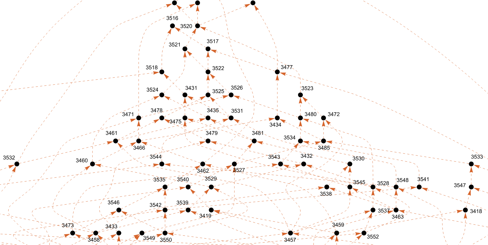

# tfhe-rs examples
## Examples for the tfhe-rs lib

## Log mand bc-format

$ cargo run --release
   Compiling aes_128_threads v0.1.0 (/home/tfhe-rs-examples/aes_128_threads)
    Finished release [optimized] target(s) in 2.55s
     Running `target/release/aes_128_threads`
ref AES-ECB         17d614f379a9359077e95577fd31c20a
CPU:s physical      56
CPU:s logical       112
file bc read time   3.97ms
parse file time     13.26ms
gen keys time       200.78ms

client_key time ||  4.69ms
at step 36662 out of 36663 
**bc time  ||         19.17s**
out time            147.01ms
cloud AES           17d614f379a9359077e95577fd31c20a
